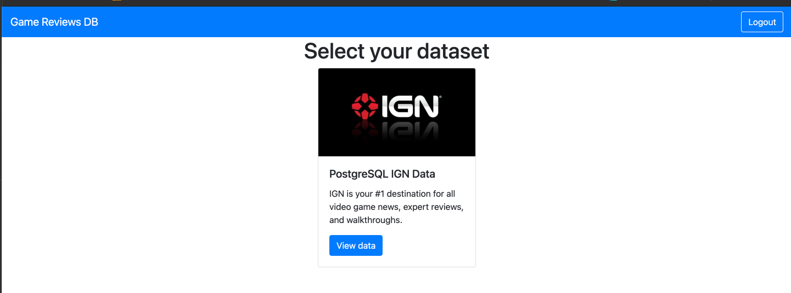
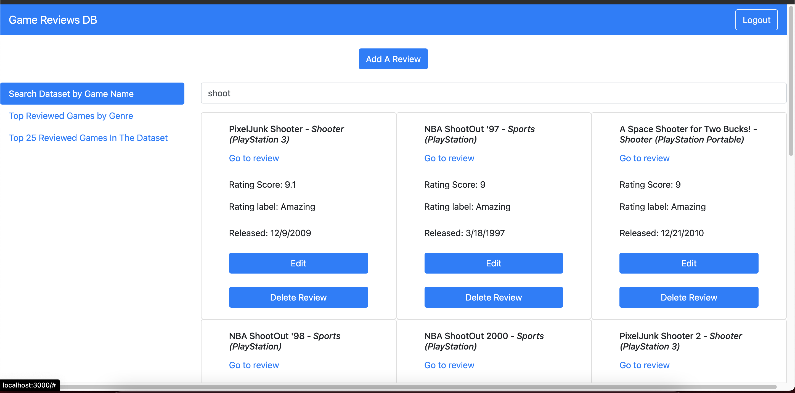
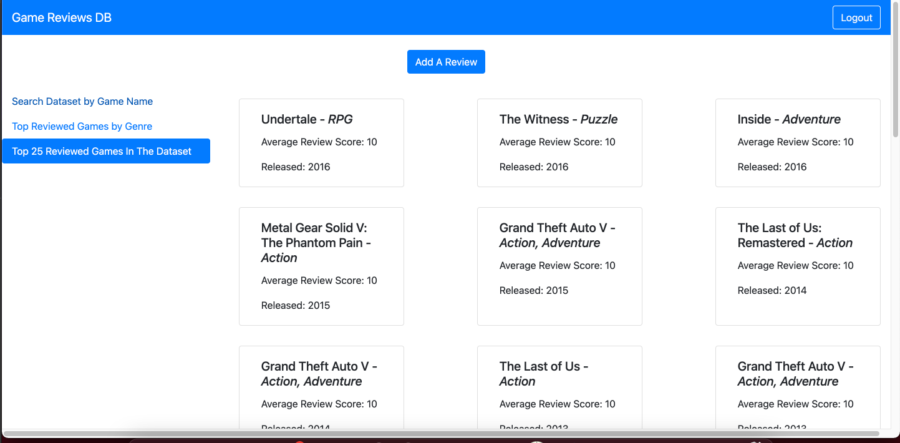
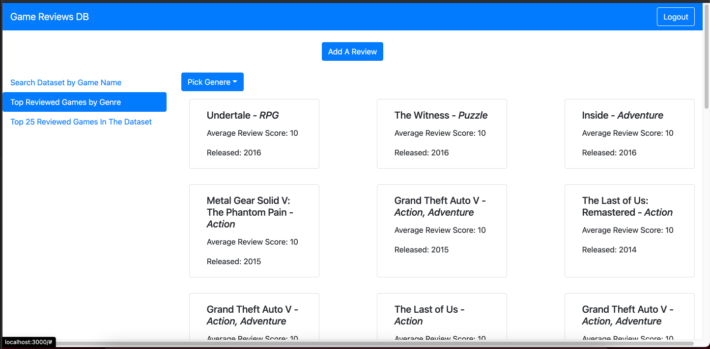

# CS480 Final Project
Our final project uses multiple database providers linked to different datasets and allows users to use our React Web client to view data from said datasets.

## Group Members
Alex Chomiak

Clark Chen

Jigar Patel

## Install Prerequisite
- Have the latest version of docker, docker-compose, node and npm install
- Install pm2 to allow running in the background `npm i pm2 -g`

## Start the project
- Start up docker for DB servers: `docker-compose up -d`
- Install api dependencies: `npm i --prefix ./api`
- Build api: `npm run build --prefix ./api`
- Import data: `npm run import-data pm2 --prefix ./api`
- Run api service: `npm run pm2 --prefix ./api`
- Install client dependencies: `npm i --prefix ./client`
- Build client: `npm run build --prefix ./client`
- Run client service: `npm run pm2 --prefix ./client`

## Stop the project
- Stop client service: `npm run pm2-stop --prefix ./client`
- Stop api service: `npm run pm2-stop --prefix ./api`
- Stop docker for DB servers: `docker-compose down`

## Screenshots

